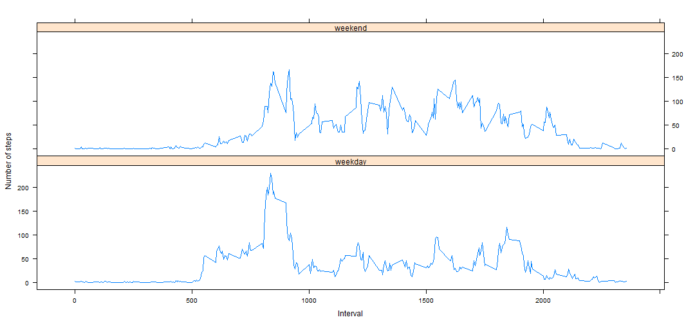

## Loading and preprocessing the data

```r
originalData <- read.csv("activity.csv")
```

## What is mean total number of steps taken per day?
>For this part of the assignment, you can ignore the missing values in the dataset.
 1. Make a histogram of the total number of steps taken each day
 2. Calculate and report the mean and median total number of steps taken per day

In this section  we want to generate the overall mean (average) of the total number of steps taken per day.
Steps atre as follows:

1. A dataset containing the total number of steps taken each day is created.

```r
dailyStepSum <- aggregate(originalData$steps, list(originalData$date), sum)
```

A portion of the new dataset is as follows:

```
##          Date Steps
## 1  2012-10-01    NA
## 2  2012-10-02   126
## 3  2012-10-03 11352
## 4  2012-10-04 12116
## 5  2012-10-05 13294
## 6  2012-10-06 15420
## 7  2012-10-07 11015
## 8  2012-10-08    NA
## 9  2012-10-09 12811
## 10 2012-10-10  9900
## 11 2012-10-11 10304
## 12 2012-10-12 17382
## 13 2012-10-13 12426
## 14 2012-10-14 15098
## 15 2012-10-15 10139
## 16 2012-10-16 15084
## 17 2012-10-17 13452
## 18 2012-10-18 10056
## 19 2012-10-19 11829
## 20 2012-10-20 10395
```

2. Histogram for above data is below.


```r
  with(dailyStepSum, {
      par(oma=c(2,0,0,0), mar=c(6.75,6.75,3,0), mgp=c(5.75,0.75,0), las=2)
      barplot(
        height=Steps,
        main="Graph of Total Steps taken per Day",
        xlab="Dates",
        ylab="Steps per Day",
        names.arg=Date,
        space=c(0)
      )
  })
```

 

3. Calculating median and mean values and also ignoring NA values using the above dataset.

  1. Mean
    
    ```r
      dailyStepMean <- mean(dailyStepSum$Steps, na.rm=TRUE)
    ```
      
      ```
      ## [1] 10766.19
      ```
  2. Median
    
    ```r
      dailyStepMedian <- median(dailyStepSum$Steps, na.rm=TRUE)
    ```
    
    ```
    ## [1] 10765
    ```

## What is the average daily activity pattern?
>What is the average daily activity pattern?
 1. Make a time series plot (i.e. type = "l") of the 5-minute interval (x-axis) and the average number of steps taken, averaged across all days (y-axis)
 2. Which 5-minute interval, on average across all the days in the dataset, contains the maximum number of steps?

Here we want to find the average steps taken for each 5-minute time interval averaged over all the days in the data.

1. Get the mean (average) number of steps taken by ignoring NA values for each 5-minute interval, itself averaged across all days.
  

```r
  intervalSteps <- aggregate(
      data=originalData,
      steps~interval,
      FUN=mean,
      na.action=na.omit
  )
  colnames(intervalSteps) <- c("Interval", "AvgStepsAvgAcrossDay")
```
  
2. The Time-Series plot is below


```r
  with(intervalSteps, {
      plot(
        x=Interval,
        y=AvgStepsAvgAcrossDay,
        type="l",
        main="Time-Series of Average Steps against Interval",
        xlab="5-minute Interval",
        ylab="Average Steps, Average across all Days"
        
      )
  })
```

 
  
3. Find the 5-minute interval with the maximum number of steps


```r
  intervalMax <- intervalSteps[intervalSteps$AvgStepsAvgAcrossDay==max(intervalSteps$AvgStepsAvgAcrossDay),]
```
  
  ```
  ##     Interval AvgStepsAvgAcrossDay
  ## 104      835             206.1698
  ```
  Therefore, the interval between **835** and  **840** minutes has the maximum number of steps.


## Imputing missing values
>Note that there are a number of days/intervals where there are missing values (coded as NA). The presence of missing days may introduce bias into some calculations or summaries of the data.
 1. Calculate and report the total number of missing values in the dataset (i.e. the total number of rows with NAs)
 2. Devise a strategy for filling in all of the missing values in the dataset. The strategy does not need to be sophisticated. For example, you could use the mean/median for that day, or the mean for that 5-minute interval, etc.
 3. Create a new dataset that is equal to the original dataset but with the missing data filled in.
 4. Make a histogram of the total number of steps taken each day and Calculate and report the mean and median total number of steps taken per day. Do these values differ from the estimates from the first part of the assignment? What is the impact of imputing missing data on the estimates of the total daily number of steps?

Here we want to get a new graph using the same data as from the first section but with its NA values replaced.

To achieve this, the mean (average) 5-minunte interval values as from the previous section will be used to replace the NA values.

1. Total number of rows with NA values in original data.


```r
  countNA <- nrow(subset(originalData, is.na(originalData$steps)))
```

2. The average 5-minute interval values from the prevous section is used to replace the NA values of the original data and a new dataset will be generated from the latter.

 Decimal values will be rounded up to a whole number.
 

```r
  stepValues <- data.frame(originalData$steps)
  stepValues[is.na(stepValues),] <- ceiling(tapply(X=originalData$steps,INDEX=originalData$interval,FUN=mean,na.rm=TRUE))
  newData <- cbind(stepValues, originalData[,2:3])
  colnames(newData) <- c("Steps", "Date", "Interval")
```
  

3. The total number of steps taken each day is generated using this new dataset.


```r
  newDailyStepSum <- aggregate(newData$Steps, list(newData$Date), sum)
```

A portion of the new dataset is as follows:

```
##          Date Steps
## 1  2012-10-01 10909
## 2  2012-10-02   126
## 3  2012-10-03 11352
## 4  2012-10-04 12116
## 5  2012-10-05 13294
## 6  2012-10-06 15420
## 7  2012-10-07 11015
## 8  2012-10-08 10909
## 9  2012-10-09 12811
## 10 2012-10-10  9900
## 11 2012-10-11 10304
## 12 2012-10-12 17382
## 13 2012-10-13 12426
## 14 2012-10-14 15098
## 15 2012-10-15 10139
## 16 2012-10-16 15084
## 17 2012-10-17 13452
## 18 2012-10-18 10056
## 19 2012-10-19 11829
## 20 2012-10-20 10395
```

4. A histogram of the above data is created as a form of visual representation.


```r
  with(newDailyStepSum, {
      par(oma=c(2,0,0,0), mar=c(6.75,6.75,3,0), mgp=c(5.75,0.75,0), las=2)
      barplot(
        height=Steps,
        main="Graph of Total Steps taken per Day",
        xlab="Dates",
        ylab="Steps per Day",
        names.arg=Date,
        space=c(0)
      )
  })
```

 

5. Calculate the mean and median values of this new dataset (NA values replaced with mean).

  1. Mean
    
    ```r
      newDailyStepMean <- mean(newDailyStepSum$Steps)
    ```
      
    
    ```
    ## [1] 10784.92
    ```
  2. Median
    
    ```r
      newDailyStepMedian <- median(newDailyStepSum$Steps)
    ```
    
    ```
    ## [1] 10909
    ```
      
6 It seems that adding the missing values to the original data has caused both the mean and median values to increase.

  1. Mean:
  
      10766 to 10784
  2. Median:
  
      10765 to 10909


## Are there differences in activity patterns between weekdays and weekends?
>For this part the weekdays() function may be of some help here. Use the dataset with the filled-in missing values for this part.
 1. Create a new factor variable in the dataset with two levels - "weekday" and "weekend" indicating whether a given date is a weekday or weekend day.
 2. Make a panel plot containing a time series plot (i.e. type = "l") of the 5-minute interval (x-axis) and the average number of steps taken, averaged across all weekday days or weekend days (y-axis). The plot should look something like the following, which was creating using simulated data:

1.  Add new column specifying whether the date is a weekday or a weekend to the new dataset created in the previous section.


```r
  dateDayType <- data.frame(sapply(X=newData$Date, FUN=function(day) {
    if (weekdays(as.Date(day)) %in% c("Monday", "Tuesday", "Wednesday", "Thursday", "Friday")) {
      day <- "weekday"
    }
    else {
      day <- "weekend"
    } 
  }))
  
  newDataWithDayType <- cbind(newData, dateDayType)
  
  colnames(newDataWithDayType) <- c("Steps", "Date", "Interval", "DayType")
```
  
  
2. The data is then separated into weekday or weekend and the mean (average) number of steps taken for each 5-minute interval, itself averaged across all weekday days or weekend days is calculated.


```r
  dayTypeIntervalSteps <- aggregate(
      data=newDataWithDayType,
      Steps ~ DayType + Interval,
      FUN=mean
  )
```

3. Finally, a panel plot of both weekend and weekday graphs is generated.


```r
  library("lattice")
  
  xyplot(
      type="l",
      data=dayTypeIntervalSteps,
      Steps ~ Interval | DayType,
      xlab="Interval",
      ylab="Number of steps",
      layout=c(1,2)
  )
```

 
